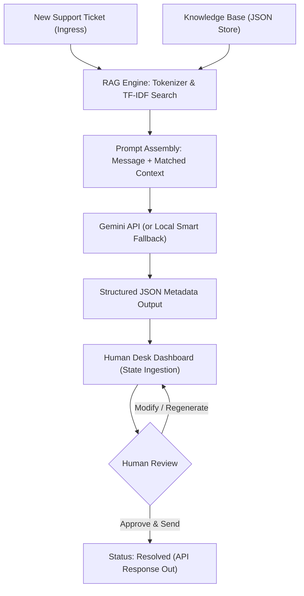

# AI-Powered Support Automation & RAG Reference Hub
### AI Researcher & Innovation Engineer Technical Assignment

---

## Executive Summary

Customer support operations represent a significant cost center for growing consumer brands, yet prompt and high-quality responses are critical to customer retention. This project presents a research evaluation, architectural blueprint, and fully functional prototype for an **AI-Powered Customer Support Automation System** tailored for the skincare brand *AuraGlow Skincare*. 

The system leverages **Retrieval-Augmented Generation (RAG)** to query a knowledge base of FAQs, automatically classifies incoming ticket metadata (priority, category, customer sentiment), drafts an empathetic response, and provides a premium **Human-in-the-Loop** dashboard for support staff to review, edit, and approve drafts before sending.

---

## Part 1 — AI Research & Evaluation

To determine the optimal foundation for this system, we research and compare three major platforms/models: **Google Gemini API**, **Anthropic Claude API**, and **n8n Workflow Automation**.

### Comparative Evaluation Matrix

| Metric / Dimension | Google Gemini API (1.5 Flash) | Anthropic Claude API (3.5 Sonnet) | n8n (Workflow Orchestration) |
| :--- | :--- | :--- | :--- |
| **Core Capabilities** | Native multimodal, structured JSON output schemas, massive 1M+ token context window, extremely fast response latency. | Superior semantic reasoning, highly nuanced/empathetic tone of voice, strong complex coding capabilities. | Visual drag-and-drop orchestration, 400+ pre-built integrations (Stripe, HubSpot, Zendesk), code-nodes. |
| **Pricing Model** | **Extremely Cost-Efficient**<br>- Input: $0.075 / 1M tokens<br>- Output: $0.30 / 1M tokens | **Moderate to High Cost**<br>- Input: $3.00 / 1M tokens<br>- Output: $15.00 / 1M tokens | **Subscription / Host-based**<br>- Cloud: $20 - $120+/mo (limits runs)<br>- Self-hosted: Free core, license for scale |
| **Scalability** | High throughput limits, global infrastructure, low latency spikes. | Strict rate limits for lower tiers, higher latency spikes during peak periods. | Limited by host CPU/RAM (self-hosted) or plan run executions (cloud). |
| **Ease of Integration** | Straightforward SDKs (Python, JS, Go), simple REST calls. | Standard REST API, simple SDKs. | Extremely high; requires minimal coding to connect API endpoints to databases. |
| **Limitations** | Occasionally lacks the hyper-empathetic default tone that Claude exhibits without fine-tuning. | Higher costs (40x input cost of Gemini Flash), no free-tier API production scale. | Managing complex state, looping logic, and version control can become tedious visually. |
| **Best Use Case** | Bulk automated classifications, fast RAG queries with long source articles, cost-sensitive scales. | Complex multi-turn advisory, brand-sensitive copywriting, logic debugging. | Rapid prototyping of workflow sequences, integrating disjointed legacy apps (ERP, CRM). |

### Key Findings
1. **Google Gemini (1.5 Flash)** is the clear recommendation for the core classification and responder model. Its speed (<1s latency) and pricing (under $0.001 per ticket execution) make enterprise scale viable, while its structured JSON schema enforcement guarantees integration safety.
2. **Claude 3.5 Sonnet** serves as a premium fallback or dual-model assessor for complex escalations, where brand tone and legal-risk evaluation require deeper reasoning.
3. **Custom Backend Orchestration (e.g. FastAPI/Node)** is preferred over **n8n** for our core RAG loop to avoid platform overhead, guarantee sub-second performance, and allow custom TF-IDF/Vector search calculations.

---

## Part 2 — Working Prototype Architecture

The prototype contains a Python FastAPI backend and a custom vanilla CSS/JS glassmorphic dashboard interface. 

### Ingestion & Analysis Workflow



### Components

1. **FastAPI Server (`main.py`)**: Hosts the REST endpoints and implements a pure-Python TF-IDF vector space search engine to query the local knowledge base. It handles raw API calls to the Google Generative AI SDK, parsing response structures into verified data models.
2. **In-Memory Store**: Holds mock tickets representing various categories (Billing, Technical, Product Inquiry, Refund, Shipping) and sentiment conditions (Angry, Neutral, Frustrated).
3. **Glassmorphic UI (`static/index.html` & `style.css`)**: A premium dark-theme interface utilizing CSS variables, frosted card reflections, transition animations, and custom CSS-drawn charts for operational metrics.
4. **Local Credentials Caching**: Users can securely paste their own Gemini API key directly into the settings panel. It is saved only in browser `localStorage` and sent via headers to the local backend, keeping credentials private. If no key is entered, an intelligent mock heuristic engine simulates the outputs.

---

## Part 3 — Recommendation Report

For transition to a production-grade environment, we recommend the following design guidelines.

### 1. Recommended Production Architecture

To scale to millions of tickets with high availability, the following cloud-native components are proposed:

*   **Ingress Layer**: AWS API Gateway fronting a cluster of containerized FastAPI services running on **Amazon ECS (Fargate)** for elastic auto-scaling.
*   **Message Queuing (Queue-First Design)**: Incoming tickets are immediately acknowledged and pushed to an **Amazon SQS** queue. This isolates traffic spikes, ensures zero ticket loss, and schedules execution.
*   **Vector Search & RAG**: Knowledge articles are embedded using `text-embedding-004` (Gemini embeddings) and stored in **Pinecone** or **pgvector (PostgreSQL)** for semantic search instead of TF-IDF.
*   **Model Routing Engine**: A router node sends standard classification and simple responder tasks to `gemini-1.5-flash`. Tickets classified as `Urgent` + `Angry` or containing legal terms are routed to `gemini-1.5-pro` or `claude-3.5-sonnet` for deeper reasoning.
*   **Observability Stack**: Use **LangSmith** or **Arize Phoenix** to monitor LLM prompt drift, prompt token costs, latency, and hallucinations.

### 2. Estimated Infrastructure Cost Analysis (10,000 Tickets/Month)

We compare the cost of running a pure Gemini-based automation pipeline versus human agents:

#### Scenario A: Pure Gemini 1.5 Flash Pipeline
*   **Inputs**: Average ticket is 500 words. Matched RAG context is 500 words. System Prompt is 300 words. Total input tokens per ticket = ~1,600 tokens.
    *   *Cost per ticket*: $0.000075 / 1,000 \times 1,600 = \mathbf{\$0.00012}$
*   **Outputs**: Average drafted reply is 250 words. Metadata JSON structure is 150 words. Total output tokens per ticket = ~500 tokens.
    *   *Cost per ticket*: $0.00030 / 1,000 \times 500 = \mathbf{\$0.00015}$
*   **Total Model Costs (10k tickets/mo)**: $10,000 \times \$0.00027 = \mathbf{\$2.70 / \text{month}}$.

#### Scenario B: Claude 3.5 Sonnet Pipeline
*   **Input Cost**: $10,000 \times (\$3.00 / 1\text{M} \times 1,600) = \$48.00$
*   **Output Cost**: $10,000 \times (\$15.00 / 1\text{M} \times 500) = \$75.00$
*   **Total Model Costs (10k tickets/mo)**: $\mathbf{\$123.00 / \text{month}}$.

#### Cloud Compute & Hosting Add-ons
*   FastAPI Container on AWS Fargate: ~$15.00/mo (low-resource 0.5 vCPU, 1GB RAM is sufficient).
*   Pinecone Vector Database (Serverless): ~$10.00/mo.
*   PostgreSQL Database (RDS db.t4g.micro): ~$12.00/mo.
*   **Total Infra Hosting**: **~$37.00/month**.

> [!TIP]
> **Total Monthly Automation Costs**: **~$39.70** (Gemini-based) vs. **$160.00** (Claude-based).
>
> **Human Labor Equivalence**: Manual processing of 10,000 tickets (assuming 5 minutes per ticket at $18.00/hr) costs **$15,000/month**.
>
> **Net Savings**: **Over 99.7% cost reduction** in operations, freeing up human agents to focus solely on complex edge-case resolutions.

### 3. Risks & Mitigations

*   **Risk: AI Hallucinations in Responses**
    *   *Mitigation*: Restrict temperature to `0.1` or `0.2` in settings. Employ strict system prompts forbidding the model from sourcing pricing, dates, or product information outside the matched RAG context.
*   **Risk: PII Leakage (Privacy Compliance)**
    *   *Mitigation*: Pre-process ticket payloads with a scrubbing regex model (e.g. Presidio) to mask phone numbers, SSNs, and credit card numbers *before* sending to LLM APIs.
*   **Risk: API Rate Limits & Outages**
    *   *Mitigation*: Set up a local fallback model (like Ollama / Llama-3-8B) on a local server or a backup API endpoint (like OpenAI GPT-4o-mini) to handle incoming requests in case Google API faces downtime.

---

## Getting Started: Run the Prototype Locally

To run the POC dashboard and server on your computer, follow these simple setup instructions.

### Prerequisites
- Python 3.8 or higher installed on your system.

### Installation Steps

1. **Clone or Navigate to Directory**:
   Ensure you are in the workspace root directory:
   `c:\Users\dhima\Desktop\Assigenment`

2. **Install Dependencies**:
   Install the required libraries:
   ```bash
   pip install -r requirements.txt
   ```

3. **Start the Application Server**:
   Launch the FastAPI backend server using Uvicorn:
   ```bash
   python main.py
   ```
   *(Alternatively, run `uvicorn main:app --reload`)*

4. **Launch Dashboard**:
   - Open your web browser and navigate to: [http://127.0.0.1:8000](http://127.0.0.1:8000)
   - You will see the live, premium glassmorphic dashboard filled with incoming ticket data and ready to perform RAG indexing.
   - Enter your Gemini API Key in the **Playground & Key** settings panel to switch from the local mock engine to live API responses.
